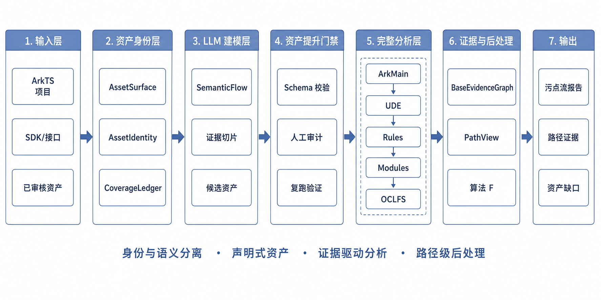

# ArkTaint

**面向 HarmonyOS / ArkTS 应用的静态污点流分析框架**

[](LICENSE)
[](https://www.typescriptlang.org/)
[](https://nodejs.org/)
[](https://developer.huawei.com/consumer/cn/harmonyos)

ArkTaint 用于在 HarmonyOS / ArkTS 项目中恢复从 source 到 sink 的静态污点流。它围绕 ArkTS 语言特性、HarmonyOS 托管入口、框架回调、状态交接、项目 API 封装和第三方 SDK 建模，生成可追溯的分析结果和路径证据。

项目适合用于 HarmonyOS 应用安全研究、框架 API 建模、真实项目污点流审计、静态分析算法实验，以及安全资产的持续迭代。

## 功能特性

- **HarmonyOS / ArkTS 专向分析**：覆盖 Ability、Extension、Component、装饰器、框架回调、存储、路由、事件和异步执行等常见模式。
- **声明式安全资产**：Rules、Modules、ArkMain 三类资产使用统一的 surface / binding / effect-template 表达方式。
- **API 身份与语义分离**：先确认 API 面，再绑定 source、sink、transfer、handoff、entry 等安全语义，适合处理官方 API、项目封装和第三方 API。
- **SemanticFlow 建模链路**：可将预分析证据包交给 OpenAI-compatible LLM，为陌生项目 API 生成可校验的候选资产。
- **OCLFS 流敏感分析**：通过 StateCell、StateEffect 和 currentness certificate 处理覆盖、删除、状态槽失效和 key mismatch 等场景。
- **证据化报告**：输出污点流、覆盖缺口、路径物化结果、后处理决策和可审计的 Markdown / JSON 报告。

## 架构概览



ArkTaint 的主流程由六个阶段组成：

```text
项目源码 / SDK / 已有资产
        |
        v
资产注册表
        |
        v
预分析证据包
        |
        v
SemanticFlow 建模
        |
        v
资产校验与提升
        |
        v
完整污点分析
        |
        v
证据图、路径物化与后处理
        |
        v
报告与资产缺口
```

核心模块：

- **Asset Registry**：加载内置资产和项目资产，建立 API 身份、语义角色、endpoint、guard 和 cellKind 索引。
- **PreAnalysis**：扫描源码中的调用、入口、装饰器、回调和访问面，生成建模证据包。
- **SemanticFlow**：基于证据包生成项目 API 的候选建模结果。
- **Asset Promotion**：对候选资产进行结构校验、源码锚定、审计和复跑，形成可复用项目资产。
- **Full Analysis**：实例化 Rules、Modules、ArkMain 和 IR effect，执行污点传播。
- **OCLFS**：在变量、字段、容器、状态槽、路由、事件、Promise 等 StateCell 上进行流敏感 currentness 判断。
- **Provenance / Postsolve**：记录基础证据图，物化路径，输出路径级和 flow 级决策。

## 安装

环境要求：

- Node.js 18+
- npm
- Git

安装依赖并构建：

```bash
npm install
npm run build
```

构建过程中会准备仓库内的 ArkAnalyzer 子工程，然后编译 TypeScript 代码。

## 快速开始

运行内置示例：

```bash
npm run analyze:demo
```

分析一个 ArkTS 项目：

```bash
npm run analyze -- \
  --repo D:/work/MyArkApp \
  --sourceDir entry/src/main/ets \
  --model-root src/models \
  --profile default \
  --outputDir tmp/test_runs/my_app/latest
```

常用参数：

| 参数 | 说明 |
| --- | --- |
| `--repo` | HarmonyOS 项目根目录。 |
| `--sourceDir` | ArkTS 源码目录，多个目录可用逗号分隔。 |
| `--model-root` | 安全资产目录，通常为 `src/models`。 |
| `--profile` | 分析档位：`default`、`fast` 或 `strict`。 |
| `--maxEntries` | 限制入口数量，便于调试大型项目。 |
| `--outputDir` | 分析输出目录。 |

查看当前可用模型和模块：

```bash
npm run analyze -- --repo D:/work/MyArkApp --list-models
npm run analyze -- --repo D:/work/MyArkApp --list-modules
npm run analyze -- --repo D:/work/MyArkApp --trace-module <module-id>
```

## SemanticFlow 与 LLM 建模

ArkTaint 可以使用 OpenAI-compatible HTTP API 为陌生项目 API 生成候选建模结果。先配置一个本地 LLM profile：

```powershell
$env:ARKTAINT_LLM_API_KEY="your-api-key"
npm run llm -- --profile local-llm --baseUrl https://example.com/v1 --model your-model --apiKeyEnv ARKTAINT_LLM_API_KEY
npm run llm -- --show
```

启用自动建模分析：

```bash
npm run analyze -- \
  --autoModel \
  --repo D:/work/MyArkApp \
  --sourceDir entry/src/main/ets \
  --model-root src/models \
  --llmProfile local-llm \
  --publish-model my_project_pack \
  --outputDir tmp/test_runs/my_app_semanticflow/latest
```

SemanticFlow 会将项目中的未覆盖 API 面、调用上下文、源码切片和资产覆盖情况整理成证据包，再生成符合 ArkTaint 资产结构的项目建模结果。

## 输出结果

一次分析通常会产生：

- source、sink、path 和 evidence id 组成的污点流记录；
- API surface 覆盖情况和资产缺口；
- SemanticFlow 候选资产与校验诊断；
- 基础证据图、PathView、PathClass 和 PathGap；
- PathDecision、FlowDecision 和 Markdown 审计摘要。

输出目录由 `--outputDir` 指定，适合用于单次审计、回归测试和实验对比。

## 安全资产

ArkTaint 使用三类安全资产描述分析语义：

| 类型 | 用途 |
| --- | --- |
| Rules | source、sink、sanitizer、transfer 等局部安全语义。 |
| Modules | storage、container、callback、event、route、promise、handoff 等框架或 SDK 语义。 |
| ArkMain | HarmonyOS 生命周期、组件入口、框架回调和调度入口。 |

资产由四部分组成：

- `surfaces`：资产覆盖的 API 或程序面；
- `bindings`：surface 上的语义角色、endpoint 和 guard；
- `effectTemplates`：匹配到具体程序点后实例化的语义 effect；
- `relations`：有证据的 facade、wrapper 或语义复用关系。

相关文档：

- [Rule schema](docs/rule_schema.md)
- [Module development guide](docs/module_development_guide.md)
- [Engine plugin guide](docs/engine_plugin_guide.md)
- [LLM context skills and compression](docs/llm_context_skills_and_compression.md)

## 测试

常用命令：

```bash
npm run build
npm run verify
npm run test:smoke:core
```

按模块运行测试：

```bash
npm run test:asset-schema-v2
npm run test:asset-registry-bootstrap
npm run test:cellkind-registry-dynamic
npm run test:algorithm-e-oclfs
npm run test:provenance-evidence-graph-boundary
npm run test:postsolve-scoped-evidence-contract
```

真实项目 smoke manifest 位于 `tests/manifests/real_projects/`。

## 仓库结构

```text
src/
  cli/                    # analyze、llm、semanticflow 命令行入口
  core/
    assets/               # 资产 schema、registry、coverage、promotion
    cellkind/             # 动态 cellKind registry
    orchestration/        # 完整分析和运行时阶段
    provenance/           # 证据图与路径物化
    rules/                # rule asset lowering 与运行时接入
    semanticflow/         # LLM 证据包和候选资产处理
  models/
    kernel/               # 内置 rules、modules、arkmain 资产
    project/              # 项目资产包
  tests/                  # contract、algorithm、pipeline、smoke 测试

docs/                     # 使用和扩展文档
tests/manifests/          # benchmark 与真实项目 manifest
assets/readme/            # README 图片资源
tmp/                      # 本地运行产物
output/                   # 分析输出
```

## 文档

- [CLI usage](docs/cli_usage.md)
- [Rule schema](docs/rule_schema.md)
- [Module development guide](docs/module_development_guide.md)
- [Engine plugin guide](docs/engine_plugin_guide.md)
- [Test suite notes](src/tests/README.md)
- [Manifests](tests/manifests/README.md)

## License

ArkTaint is released under the [Apache License 2.0](LICENSE).
