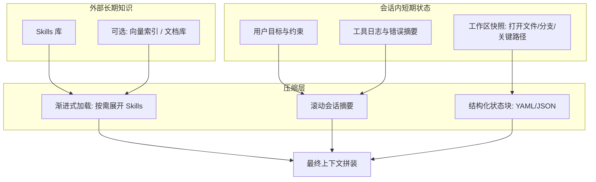

# LLM 上下文记忆性改进：Skills 体系、上下文压缩与工程落地

> 文档目的：在引入大语言模型（LLM）参与 ArkTaint 相关工作（规则推断、代码理解、诊断解释、自动化修复等）后，系统性缓解「上下文窗口有限」「长对话遗忘」「重复说明成本高」等问题；并与本仓库已落地的 `.cursor/skills`、`docs/skills/registry.json`、`skills:validate`、`context:pack` 对齐，给出**可评审、可排期、可回归**的工程要求。  
> 读者：技术负责人与实现同学。  
> 说明：本文档由 `docs/llm_context_skills_and_compression_plan.md`（方案草案）与 `docs/skills_and_context_compression_followup.md`（落地复盘与 P0）合并而成，二者已废弃，请以本文为唯一权威来源。

### 参考与原创性说明（必读）

- 本仓库在调研阶段对照过**一类 Agent 产品**里常见的工程化做法（技能目录约定、frontmatter 元数据、按路径懒激活、阈值触发摘要、压缩后再注入的 token 封顶等）。  
- **本文不摘录任何第三方提示词、专有配置键或产品文案**；下列条款用 ArkTaint 语境下的**抽象机制与落地建议**表述，便于评审与合规。  
- 若将来在代码中实现「自动摘要」，须使用**团队自有提示模板**，并与法务/开源许可核对训练数据与依赖边界。

---

## 1. 背景与问题定义

### 1.1 现状

- LLM 的有效推理依赖**稳定、可检索、可复用**的项目知识与流程知识。
- 纯「把整仓代码/整段历史对话塞进上下文」不可持续：窗口有限、成本高、噪声大，且模型对远端上下文的「记忆感」弱于近端内容。

### 1.2 需要区分的两类「记忆」

| 类型 | 含义 | 适合载体 |
|------|------|----------|
| **程序性记忆**（How） | 固定流程、约束、工具用法、评审清单 | Skills、Rules、Runbook |
| **情景记忆**（What happened） | 当前任务结论、分支决策、未提交改动、临时假设 | 会话摘要、工作项状态、结构化笔记 |

本方案：**Skills 负责程序性记忆**；**压缩与分层摘要负责情景记忆的滚动保留**。

### 1.3 成功标准（建议作为验收指标）

- **可重复性**：新会话能在不重复长篇背景的情况下恢复工作（例如 5 分钟内可读材料恢复 80% 有效上下文）。
- **一致性**：对同一类任务（如「新增一条 transfer 规则并跑 smoke」）输出风格与约束一致。
- **成本**：平均每次会话的输入 token 下降（相对无 Skills、无压缩基线），且质量不显著回退。
- **可治理**：Skills 有版本、所有者、适用范围，避免「民间提示词」碎片化。

### 1.4 工程共识（团队补充：北极星）

在已具备 Skills 与 `context:pack` 初版落地的前提下，团队补充如下共识（优先级高于「堆更多背景给模型」）：

- **一致性优先于信息量**：机制应保证**多次运行过程与结果一致**，并在预算不足时仍能**不丢关键约束**。
- **单一事实来源（SSoT）**：`docs/skills/registry.json` 与各 `SKILL.md` frontmatter 中并列维护的 `owners`、`triggers`、`quality gates` 等元数据**不得长期各写各的**，必须选定生成或校验策略，避免 Agent 在矛盾信息下幻觉补全。
- **压缩优先确定性**：上下文裁剪/拼装应由**可测试的确定性算法**完成（预算、优先级、must-keep、稳定排序）；模型可用于解释与决策，但不宜作为「压缩规则本身」的唯一来源。

---

## 2. 总体架构（概念）



**核心思想**：把「每次都讲一遍」的内容固化到 Skills；把「这次任务走到哪」的内容用结构化状态 + 滚动摘要维护；拼装时遵守 token 预算与优先级策略。

---

## 3. Skills 文件夹方案

### 3.1 定位

Skills 是**给 Agent/LLM 用的可执行说明**：何时读、读什么、按什么步骤做、哪些事禁止做、如何调用本仓库脚本与测试门禁。

与以下概念的关系（避免重复建设）：

- **README / 设计文档**：给人读的长文；Skills 应更短、更可执行。
- **Cursor Rules（`.cursor/rules`）**：偏全局强制约束；Skills 偏**任务域**与**流程**。
- **代码内注释**：解释局部实现；Skills 解释跨模块工作流。

### 3.2 推荐目录结构（仓库内）

以下路径与常见 Cursor/Codex 习惯兼容，可按团队规范微调。建议**每个 Skill 独占一个目录**，入口文件固定为 `SKILL.md`（便于脚本扫描、与「frontmatter + 正文分包」一致）：

```text
docs/
  skills/                          # 可选：与本文档放一起，便于评审
    README.md                      # 索引：有哪些 skill、何时用

.cursor/
  skills/                          # 若使用 Cursor Agent Skills
    arktaint/
      README-skill-index.md        # 可选：极短索引（触发语 → 路径），供人类与 Agent 快速跳转
      rule-authoring/
        SKILL.md                   # 子域：写规则（目录名即 skill id）
      smoke-and-ci/
        SKILL.md                   # 子域：跑 smoke / 解释失败
      llm-governance/
        SKILL.md                   # 子域：LLM 输出如何落盘、如何审计

  rules/
    arktaint-core.mdc              # 全局硬约束（与 skills 互补）
```

**原则**：

- **一个 Skill 一个责任**：避免「万能 SKILL.md」。
- **SKILL.md 顶部写元数据**：适用场景、前置条件、禁止事项、相关脚本路径。
- **引用而非粘贴**：大段规则/schema 用链接指向 `docs/rule_schema.md` 等权威文档，Skill 内只写「必读章节」与「执行清单」。
- **同名与重复路径治理**：若存在软链、多根工作区或复制目录，应用「规范路径 / 内容哈希 / 评审记录」三选一消歧，避免同一 Skill 在索引中出现多次。

### 3.3 Skill 文档模板（建议字段）

每个 `SKILL.md` 建议包含：

1. **Title / 一句话用途**
2. **Triggers**：什么用户请求应激活本 Skill（关键词或任务类型）
3. **Inputs**：需要用户或系统提供什么（分支、manifest 路径、规则文件路径）
4. **Procedure**：编号步骤（可对应 runbook）
5. **Quality gates**：必须运行的命令与期望现象（例如 `npm run test:smoke:core`）
6. **Failure modes**：典型错误 → 如何定位 → 下一步
7. **Stop conditions**：何时必须停下来问人（权限、破坏性操作、不确定的语义）
8. **References**：仓库内路径列表（相对路径）

**Frontmatter 建议字段（与 L0 预算强相关）**  
除上文模板字段外，建议在 YAML frontmatter 中显式维护供索引用的短字段（示例名可调整，团队统一即可）：

- `summary` 或沿用 `description`：**一句话**用途（供 L0 展示）。
- `when_to_use`：与触发语同义，**短段落**，用于路由与粗估 token。
- `paths`（可选）：glob / gitignore 风格的路径模式列表；表示「仅当本轮操作触及这些路径时才允许将该 Skill 从候选提升为激活」。未配置则视为全局可用（仍建议用 L0 控制总量）。
- `allowed_tools`（可选）：若未来接入可编排工具链，用于能力白名单与审计。
- `version`、`owners`：与治理节一致。

**Frontmatter 优先的 token 粗估**  
在自动装配上下文时，**先用 frontmatter 短字段估算**各 Skill 的占用，再决定是否加载正文；避免「索引阶段就把大正文读入」。

### 3.4 Skill 的发现与加载策略（避免全量塞上下文）

采用**渐进式加载**：

1. **L0 索引层**：仅挂载每个 Skill 的 **frontmatter + 极短摘要**（或 registry 中的一行记录），总 token 可控；默认始终可挂载。
2. **L1 激活层**：命中 trigger、用户显式点名、或 **`paths` 与当前工作集相交**时，加载对应 `SKILL.md` 全文。
3. **L2 证据层**：仅在需要时读取具体文件/测试结果片段（工具读文件，而不是预读全仓）。

**路径条件激活（可选进阶）**  
当仓库极大、Skill 数量变多时，将 Skill 标注为「仅在某些子树 relevant」能显著降低噪声。实现上可用简单 glob 匹配「本轮 diff / 打开文件 / 失败栈提及路径」；**不要**从被 `.gitignore` 排除或明确视为生成物的目录自动加载 Skill（信任边界与可审计性）。

**多来源与优先级（概念）**  
若同时存在「组织级 / 用户级 / 项目级」多套 Skill，应在文档中写清**覆盖顺序**（例如项目覆盖用户），并在 `registry.json` 中标注 `source`，避免同名 Skill 行为不确定。

可选增强：

- **Skill registry**：`docs/skills/registry.json` 记录 `id`、`version`、`owners`、`tags`、`path`，供脚本或 Agent 做检索排序。
- **与 issue/PR 模板联动**：模板里要求贴「当前激活 skill」与「状态块」（见第 4 节）。

### 3.5 治理与版本

- **SemVer 或日期版本**：Skill 变更要可见；重大流程变更必须 bump。
- **评审门禁**：Skill 变更走 code review；与 CI 命令强绑定处尤其谨慎。
- **弃用策略**：旧 skill 文件保留 `DEPRECATED.md` redirect 一段周期。

### 3.6 与 ArkTaint 场景的映射示例（便于落地）

| 场景 | Skill 建议拆分 | 关键门禁命令（示例） |
|------|----------------|------------------------|
| 新增/修改污点规则 | `rule-authoring` | `npm run test:rules`、`npm run test:rule-governance` |
| 真实项目回归 | `smoke-and-ci` | `npm run test:smoke:core` / `external` |
| LLM 生成规则落盘 | `llm-governance` | schema 校验 + 最小用例集 |

（具体命令以 `package.json` 为准，Skill 内应写「单一事实来源」引用，避免重复维护出错。）

### 3.7 Registry 与 `SKILL.md`：元数据单一事实来源（落地要求）

为避免「registry 一套、frontmatter 一套」长期漂移，必须在工程上二选一（或 docs 为源、同步生成 `.cursor` 目录）：

- **方案 A（推荐）**：以 `.cursor/skills/**/SKILL.md` 的 frontmatter 为唯一来源，**生成** `docs/skills/registry.json`；CI 校验生成结果与仓库一致。
- **方案 B**：以 `docs/skills/registry.json` 为唯一来源，`skills:validate` **强制** frontmatter 与 registry 的 `owners` / `triggers` / quality gates 等字段逐字段一致（不一致即 error）。

无论 A/B，建议统一 `quality_gates` 的结构化表达（例如 `[{ script, why }]`），registry 中可再派生纯 `script` 列表供校验 `package.json`。

---

## 4. 上下文压缩技术方案

压缩的目标不是「更少字」，而是**在固定 token 预算下最大化决策相关信息的密度**。

### 4.0 有效窗口、缓冲带与触发策略（工程化要点）

将「模型宣称的上下文长度」视为上限并不够：摘要本身、系统提示、工具定义与**输出预留**都会占用窗口。建议在团队规范中区分三层数值（名称可自定）：

1. **名义窗口**：厂商文档中的上下文上限。  
2. **可用窗口**：名义窗口减去「单次摘要调用的最大输出预留」等固定开销，得到**会话可安全填充**的上限。  
3. **触发线**：可用窗口再减去一条**缓冲带**（例如固定千级 token 或按比例），当**估算已用 token** 越线则触发压缩；缓冲带用于吸收估算误差与当轮回复 spikes。

**主动 vs 被动**  

- **主动压缩**：在触发线附近周期性摘要，避免撞墙。  
- **被动压缩**：在 API 返回「提示过长」类错误后再摘要；实现简单但体验与成本波动大。  

ArkTaint 推荐以**主动为主、被动兜底**；若仅被动，应在 runbook 中写明「失败重试与熔断」。

**连续失败熔断**  
自动摘要可能因上下文仍过大、附件过多等原因连续失败。应规定：**同一任务内连续失败 N 次后停止自动重试**，改为要求人类缩小输入（贴 State Block、去掉大附件）或手动分段，避免无效 API 循环。

**长 agent 链的分段单位**  
单次用户目标下也可能包含多轮「模型—工具—模型」。分段生成摘要时，建议以**完整的模型回合边界**（而非仅人类消息）为切割参考，避免把未闭合的工具交互拦腰折叠进摘要。

### 4.1 分层摘要（Rolling Summary）

**机制**：每当对话达到阈值（轮次、token、或完成一个子里程碑），生成一段结构化摘要，替换早期冗长对话。

**摘要建议结构（强制字段）**：

- `Goal`：用户最终要什么
- `Constraints`：硬约束（性能、兼容性、不能改的文件）
- `Decisions`：已做决策列表（含理由一行）
- `Open questions`：未决问题
- `Artifacts`：关键路径（规则文件、manifest、报告目录）
- `Next actions`：下一步 3 条以内

**高保真摘要流水线（推荐，与「少抄模板」兼容）**  
为降低「越摘要越丢关键细节」的风险，可采用**两阶段**流程（实现上可以是同一次模型调用内的格式约束，或两次调用）：

1. **内部草稿阶段**：允许罗列检查点（用户原话意图、改动的文件、失败与修复、仍存疑处），用于自检完整性。  
2. **对下游可见的终稿**：从草稿提炼为结构化小节，**删除草稿中的重复与过程性废话**；若使用标记块分隔草稿与终稿，装配上下文时**只保留终稿**。

**防漂移的「下一步」**  
`Next actions` 中建议包含**对用户最新指令的短引用或逐字片段**（一两句即可），避免长任务在多次压缩后「下一步」偏离用户真实优先级。

**频率策略**：

- 每完成一个「可验证里程碑」（例如一次测试从红变绿）强制刷新。
- 长对话每 N 轮或每 M token 触发压缩。

**重附件与二进制内容**  
在调用「摘要专用」的子任务前，对大图、PDF、冗长工具输出等做**占位替换或截断**（保留「曾有附件/曾有输出」的语义），避免摘要请求本身再次触发长度上限。

### 4.2 结构化状态块（State Block）

在会话开始或每次压缩后，维护一段机器可读小块（YAML/JSON），例如：

```yaml
task_id: RULE-1234
branch: feat/rule-network-x
active_skills:
  - arktaint/rule-authoring
state: implementing
files_touched:
  - src/models/kernel/rules/transfers/network.rules.json
last_commands:
  - cmd: npm run test:rules
    result: pass
  - cmd: npm run test:smoke:core
    result: fail
    note: "sink mismatch on ..."
hypotheses:
  - "可能需要补充 callback registration transfer"
```

**价值**：比自然语言更省 token、更稳定，便于人类复制粘贴续聊。

### 4.3 证据最小化（Evidence Minimization）

- **只引用范围**：错误信息只保留 stack 顶部 + 关键 20 行上下文，不要整日志。
- **差异优先**：优先给 `diff` 或「变更点摘要」，少给无关文件全文。
- **目录树替代全文**：用「相关子树」代替全仓 tree。

### 4.3b 压缩后的「再注入」预算（避免摘要完又爆窗）

全量摘要之后，常需把少量**高价值原文**拼回上下文（例如关键 diff、失败日志片段、正在编辑的规则文件头）。应对再注入设置**硬上限**，例如：

- **再注入文件数上限**：只恢复最近触及的少数文件。
- **单文件 token 上限**：超长文件只保留头部策略说明 + 变更 hunk。
- **Skill 正文 token 上限**：激活的多个 Skill 共享一条总预算，超出则**截断 Skill 正文靠前部分优先**（执行步骤通常靠前）或拆分为二次加载。

上述数字应写进团队默认值并可按模型窗口调参；与第 4.0 节的触发线一起评审。

### 4.4 检索增强（可选，RAG）

当 Skills + 摘要仍不足时，引入向量检索或关键词检索：

- **索引对象**：`docs/**`、`*.mdc` rules、关键 schema、稳定 FAQ。
- **不索引**：大体积 lockfile、生成物、`node_modules`、临时报告全量。

**注意**：RAG 解决「找不到知识」，不自动解决「推理一致性」；仍需 Skills 固化流程。

### 4.5 工具化上下文（Tool-grounded context）

优先让模型通过工具拉取信息，而不是预先把可能用到的内容全塞进 prompt：

- 读文件：按路径读取
- 搜索：符号/字符串搜索
- 运行：短命令拿结果摘要

这属于**延迟加载**，与压缩目标一致。

### 4.5b 并行「会话侧车」笔记（可选）

除滚动摘要外，可增加一份**短生命周期、可版本化的 Markdown 笔记**（例如仅在分支或工单目录下、默认不进主分支），由子任务或人工定期更新，记录「当前结论、未决假设、关键命令结果」。  

与 Rolling Summary 的关系建议为：

- **侧车**：高频增量、偏「工作记忆」，适合人类扫读与跨工具粘贴。  
- **Rolling Summary**：低频全量、偏「压缩后的可装配上下文」。  

执行压缩时，可**先裁剪侧车再生成全量摘要**，降低主对话 transcript 的峰值。

### 4.6 「记忆」写回仓库的边界（强烈建议写清楚）

把哪些内容允许写回 git 仓库，哪些只能留在会话/工单：

| 内容 | 建议落点 |
|------|----------|
| 稳定流程与约束 | Skills / Rules |
| 某任务的中间结论 | Issue 评论 / PR 描述 / 会话摘要（不进主分支） |
| 可复用的诊断 playbook | `docs/troubleshooting/...`（需评审） |

避免把「临时猜测」当事实写进权威文档。

### 4.7 预算控制、must-keep 字段与确定性输出（与工具落地对齐）

本节把第 4.0～4.3b 的「概念」收敛为对 **`npm run context:pack`**（`src/tools/context_pack.ts`）及后续实现的**硬要求**：

- **预算**：必须支持上限（至少 **最大字符数**；可选 **估算 token**）。超预算时不得静默丢弃 must-keep。
- **must-keep（建议最小集）**：`goal`、`constraints`、`active_skills`；在任意裁剪后仍须以稳定结构保留（若仍超限，采用显式降级：例如 State Block 仅输出 must-keep 子集，并记录 `truncation: { reason, dropped_sections[] }`）。
- **规范化**：输出侧统一字段命名与类型（如一律 `goal` / `constraints[]` / `active_skills[]`），避免 `Goal` 与 `goal` 并存流入下游。
- **裁剪优先级（确定性）**：默认顺序建议为——先裁 raw 抽取列表的尾部 → 再裁 artifacts（`files_touched` / `last_commands`）尾部 → 最后才允许对 State Block 做 must-keep 子集降级；同优先级内保持**稳定排序**。
- **幂等**：同一组输入（同一 `state` + `raw` + 参数）连续运行 N 次，输出字节级一致（或团队明确约定为「规范化后一致」），作为回归测试的基线。

### 4.8 当前工具差距（指针）

详见 **第 11 节**：对 `context_pack.ts`、`skills_validate.ts` 与 `SKILL.md` 的现状问题、P0 清单与测试建议有逐条映射。

---

## 5. Skills 与压缩的协同流程（运行时）

### 5.1 会话启动（Cold start）

1. 挂载 **Skill 索引（L0）** + **用户目标一句话**。
2. 若用户提供 State Block：优先解析并校验字段完整性。
3. 命中 trigger、用户点名、或 **路径条件与当前工作集相交** → 加载对应 **L1 Skill**。
4. 需要证据 → 工具读取 **L2**。

### 5.2 会话进行中（Hot path）

- 任何超过阈值的长讨论：触发 **Rolling Summary**，把早期对话折叠为摘要 + State Block。
- 发现重复解释：检查是否缺 Skill；缺则补 Skill，而不是加长 system prompt。
- 若启用**会话侧车**：在里程碑处同步更新侧车，使被动中断后的恢复成本更低。

### 5.3 会话结束（Handoff）

- 输出「交接包」：`Summary + State Block + 相关文件列表 + 未决问题」。
- 若产出可复用知识：提 PR 更新 Skill 或 docs。

---

## 6. 实施路线（分阶段）

### 阶段 A：最小可用（1～2 周）

- 建立 `docs/skills/README.md` 索引 + 2～3 个核心 **「目录 + SKILL.md」**（规则编写、smoke、LLM 落盘治理三选一优先级按团队定）。
- 为每个 Skill 补齐 **frontmatter 短字段**（供 L0 与粗估 token），正文保持可执行步骤为主。
- 引入 **State Block** 模板（Issue/PR/聊天粘贴区）。
- 约定 **Rolling Summary** 的字段、**两阶段摘要**流程（见 4.1）与 **触发线 + 缓冲带** 的默认值（先人工执行也可）。

### 阶段 B：工程化（2～4 周）

- `registry.json` + **强校验**（路径存在性、命令存在性、**frontmatter 必填键与类型**、`references` 存在性、registry 与 frontmatter **一致性**、禁止字面量 `\n` 等格式卫生）；详见 **第 11.2 节**。
- 与 CI：对「Skill 引用的脚本名」做轻量检查（grep/JSON schema）；**合并前**建议跑通 `verify` 中与内核相关的子集（至少 `test:layer-dependency-gate`、`test:algorithm-validation`、`test:kernel-guard`）。
- 文档化 **再注入预算** 默认值与调参流程（见 4.3b）；可选实现最小脚本：从 State Block 生成「建议再注入文件列表」。
- 可选：试点 **路径条件激活**（1～2 个 Skill），验证不误伤跨目录任务。

### 阶段 C：增强检索（按需）

- 文档向量索引或本地搜索服务；建立更新策略与权限边界。

---

## 7. 风险与对策

| 风险 | 表现 | 对策 |
|------|------|------|
| Skill 陈旧 | 流程更新但 Skill 未更新 | 变更联动 review；CI 校验关键命令 |
| 过度压缩 | 丢关键约束导致错误改动 | State Block 强制字段；高风险操作前二次确认 |
| Skill 膨胀 | L0 索引太大 | 严格分层；索引只保留 triggers + 10 行摘要 |
| RAG 噪声 | 检索到无关片段 | 过滤规则、标签、白名单路径；引用出处必须显示 |
| 自动摘要死循环 | 上下文仍过大导致连续失败 | 连续失败熔断（见 4.0）；先截断附件/侧车，再摘要 |

---

## 8. 评测与回归（建议）

### 8.1 离线评测（可自动化）

- 固定一组「代表性任务包」：输入包含 State Block + 部分错误日志，评估是否给出正确下一步与正确文件定位。
- 对比基线：无 Skills / 无压缩 vs 有 Skills / 有压缩：token、步骤数、成功率。

### 8.2 人工评审抽检

- 每月抽检 N 次长会话交接包：是否能在新会话快速续作。

### 8.3 内核守护、分层隔离与性能回归（代码侧，与 LLM 正交）

LLM 与 Skills 解决的是「流程与上下文」；**分析内核是否被改坏**依赖可重复的自动化门禁。与本仓库现状对齐时建议至少保留三层（名称保持简短，避免「一句话测试文件」）：

| 层级 | 已有/推荐脚本 | 关注点 |
|------|----------------|--------|
| 结构隔离 | `npm run test:layer-dependency-gate` | `src/core` 分层（substrate / entry / kernel / rules / orchestration）与 `kernel/modules`、`kernel/rules` 对核心 API 的**白名单式**依赖，防止「为了省事一层穿透多层」。 |
| 算法契约 | `npm run test:algorithm-validation` | 固定 demo 语料上 T/F 期望，覆盖传播与捕获等路径。 |
| 内核行为包络 | `npm run test:kernel-guard`（`src/tests/runtime/test_kernel_guard.ts`） | **同一 Scene 上连续两次独立引擎**结果须一致（抓共享可变状态、顺序敏感 bug）；正例上 **sink 数量上界**（抓传播失控/重复计数）；可选 `ARKTAINT_PERF_GUARD=1` + `ARKTAINT_PERF_GUARD_MS` 做**中位数耗时**门槛（默认不启，避免 CI 机器抖动误报）。 |

**性能测试原则**：默认门禁以**确定性不变量**为主（重复性、有界输出）；_wall clock_ 硬阈值仅作可选或夜间任务，并与基线/中位数统计一起使用，与 `test_transfer_structural_callee_perf` 等现有思路一致。

**常见环境报错**：根目录未 `npm install` 时会出现 `Cannot find module 'fs'` 等 TypeScript 错误；已安装根依赖但未装子工程依赖时，运行任意依赖 `arkanalyzer/out` 的用例会报 `Cannot find module 'ohos-typescript'`。处理方式见仓库根目录 `README.md`「安装与构建」（根 `postinstall` 会安装 `arkanalyzer`，亦可手动 `npm install --prefix arkanalyzer`）。

**文件与目录命名**：测试与辅助脚本宜短（如 `test_kernel_guard`），职责在文件头注释写清即可，避免文件名承载过长场景描述。

### 8.4 单一失败用例时的分析纪律（避免「打补丁式」修复）

当出现「只有一个 case 红」时，优先按下面顺序归类，再动代码：

1. **是否破坏分层/依赖边界**（应先被 layer gate 拦住；若漏网则补 gate 而非在业务点 if）。  
2. **是否为算法语义回归**（对照 `test_algorithm_validation` 同类特征，改传播/解析的**通用规则**）。  
3. **是否为重复性与状态问题**（`test_kernel_guard` 若报「两次结果不一致」，优先查 Scene/engine 是否在分析间被写入、缓存键是否含非确定性字段）。  
4. **是否为性能退化**（用 profile 或现有 perf 用例对比中位数，确认是热点算法还是 IO/规则膨胀）。

**禁止默认路径**：仅修改单个 demo 源文件或单条规则使 case「碰巧绿了」，而不说明属于以上哪一类根因。

---

## 9. 开放问题（评审时请拍板）

1. Skills 主目录放在 `docs/skills` 还是 `.cursor/skills`（或两者：docs 为源、同步生成 agent 目录）？
2. 「压缩」由模型自生成摘要，还是由工具/脚本生成结构化摘要（更可控）？——**团队当前倾向**：以工具/脚本的**确定性裁剪 + must-keep + 预算**为主；模型生成的自然语言摘要仅作为可选层，且须受同一套 schema/预算约束（见第 4.7 节）。
3. 是否需要与内部工单系统字段对齐（task_id、分支、环境）？
4. LLM 产出落盘的审计要求（谁 review、哪些目录可写）？
5. **主动触发线**与**缓冲带**的默认值：按固定 token、按窗口比例，还是按模型分档维护一张表？
6. 是否试点**会话侧车**（见 4.5b）：落盘路径、是否进 git、与 CI 的关系？

---

## 10. 附录：与现有仓库文档的关系

本方案不替代 `docs/cli_usage.md`、`docs/rule_schema.md` 等权威说明，而是：

- 把**高频工作流**提炼为 Skills；
- 用**摘要与状态块**在长任务中保留「决策与现场」；
- 用**分层加载**控制 token 与噪声；
- 用**有效窗口 + 缓冲带 + 再注入预算**把「能跑」提升为「可预测地跑」。

评审通过后，建议下一步由负责人指定：首批 Skill 列表、State Block 模板定稿、以及是否引入 RAG 的时间窗口。

---

## 11. 当前仓库落地复盘与 P0 清单（合并自跟进文档）

> 本节对应原 `docs/skills_and_context_compression_followup.md` 的完整意图：把「方案」落到**具体文件与可测契约**上。

### 11.1 现状问题（与实现对齐）

#### 11.1.1 `SKILL.md` 字面量 `\n`（格式污染）

- **现象**：正文出现 `\n` 字符串而非真实换行。
- **影响**：Agent 读取异常，易被误解为转义语义。
- **已定位示例**：`.cursor/skills/arktaint/smoke-and-ci/SKILL.md`（「产出」段落）、`.cursor/skills/arktaint/llm-governance/SKILL.md`（Procedure 段落）。
- **治理**：正文修复 + `skills:validate` 对字面量 `\n` 报错。

#### 11.1.2 `registry.json` 与 `SKILL.md` frontmatter 双源漂移风险

- **现状**：`docs/skills/registry.json` 与各 `SKILL.md` 均维护 `owners` / `triggers` 等；`quality_gates` 在 Skill 内常为 `{ script, why }`，registry 侧为 `qualityGates: string[]`。
- **影响**：字段不一致时，Agent 可能选择相信其中一套并幻觉补全。
- **对应文件**：`docs/skills/registry.json`、`.cursor/skills/arktaint/**/SKILL.md`、`src/tools/skills_validate.ts`。

#### 11.1.3 `skills_validate` 覆盖面仍不足

**现状**（`src/tools/skills_validate.ts`）：registry 存在性、JSON 可解析、`id` 不重复、skill 文件存在、`qualityGates` 对应 `package.json` scripts、frontmatter 少量 key（多为 warning）。

**待补齐**：

- `references` 每条路径存在且为安全相对路径（禁止 `..` 越界等）。
- `id` 与路径一致性（防止多 `id` 指向同一 `SKILL.md`）。
- frontmatter **类型与非空**校验（`owners`/`triggers` 非空数组等）。
- registry 与 frontmatter **逐字段一致**（在选定 SSoT 方案下）。
- 格式卫生：字面量 `\n`、frontmatter 顶格闭合等。

#### 11.1.4 `context_pack` 偏「交接包」，缺预算与 must-keep 契约

**现状**（`src/tools/context_pack.ts`）：输出 `Context Handoff Pack`（Rolling Summary + Artifacts + 全量 State Block JSON）；从 raw 文本做关键词抽取；`generatedAt` 为时间戳。

**缺口**：最大字符/token、must-keep、优先级裁剪、超预算显式降级、输出字段规范化、以及「同输入多次运行字节级一致」的可测承诺（时间戳若写入正文需单独处理以保证幂等测试）。

#### 11.1.5 确定性压缩的测试契约尚未闭合

要把「同一输入多次运行输出一致」做成回归，需要明文规定：排序规则、去重规则、裁剪优先级、must-keep、以及 `generatedAt` 等字段是否参与 hash。

### 11.2 P0 改动清单（按优先级）

1. **清理 `SKILL.md` 字面量 `\n`**，并在 `skills_validate` 中禁止再现。
2. **落实元数据 SSoT**（第 3.7 节方案 A 或 B），统一 `quality_gates` 表达。
3. **增强 `skills_validate`**：references、id/路径、类型与非空、registry/frontmatter 一致性、格式卫生。
4. **升级 `context_pack`**：预算、must-keep、确定性裁剪与规范化输出；必要时将 `generatedAt` 移出 hash 或改为可选（由调用方传入固定时间用于测试）。
5. **补回归测试**：Skills 校验、context pack 幂等、去重与边界预算（见 11.3）。

### 11.3 测试建议（上下文压缩与确定性）

- **Skills**：frontmatter 缺字段、references 不存在、id 冲突、registry 与 frontmatter 漂移、字面量 `\n` 均应 fail。
- **Context pack 幂等**：同一 `state` + `raw` + 参数连续运行 N 次，输出 hash 一致（按团队对 `generatedAt` 的约定）。
- **去重**：大小写不同重复项、重复 decisions/next actions，顺序与数量稳定。
- **边界预算**：极小 budget、超长单条 constraint、列表爆炸、巨大 state JSON；断言 must-keep 仍在且 Markdown 结构完整、裁剪顺序符合第 4.7 节。

### 11.4 排期建议

按「先契约、后功能」：**SSoT + validate → context_pack 预算/must-keep → 幂等测试**，再考虑 token 估算、RAG、更强 signals 抽取。

---

*文档版本：v1.0（合并 `llm_context_skills_and_compression_plan` v0.3 与 `skills_and_context_compression_followup`）*  
*权威路径：`docs/llm_context_skills_and_compression.md`*
